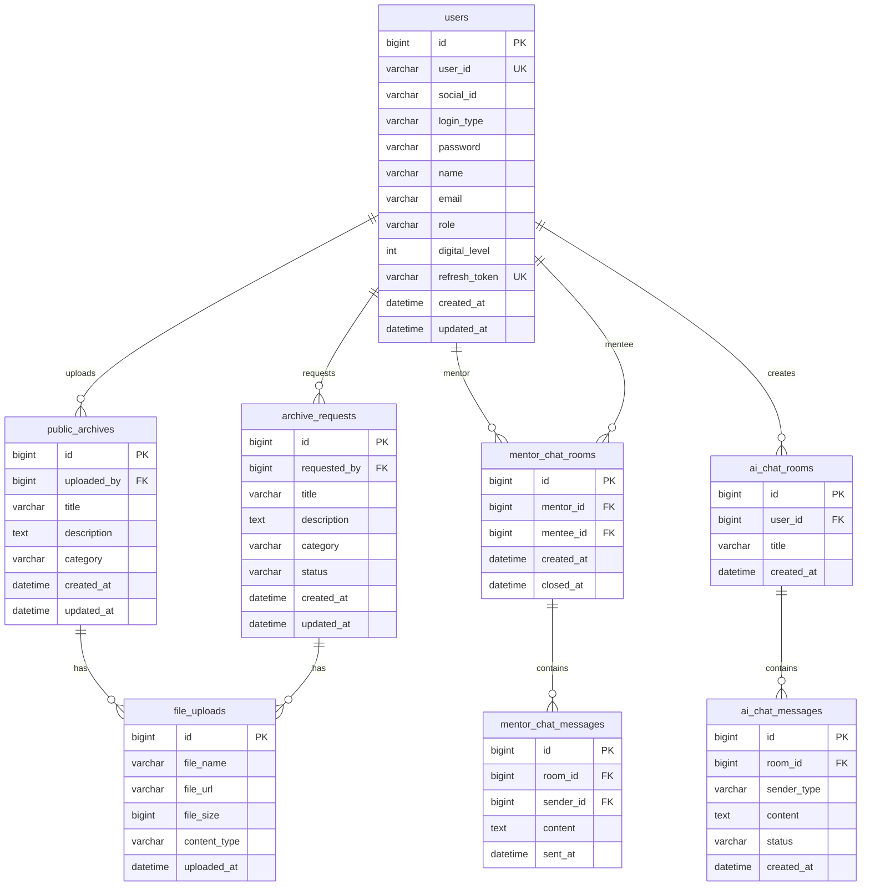
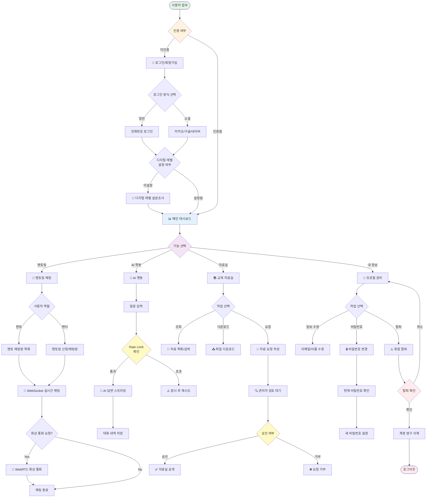
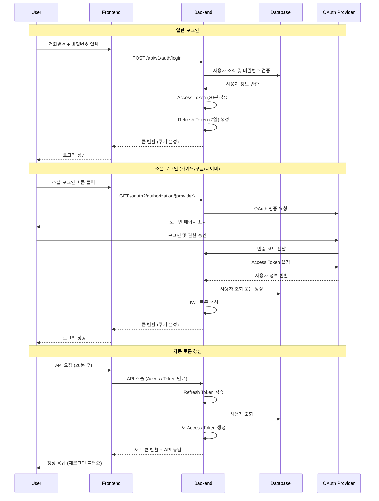
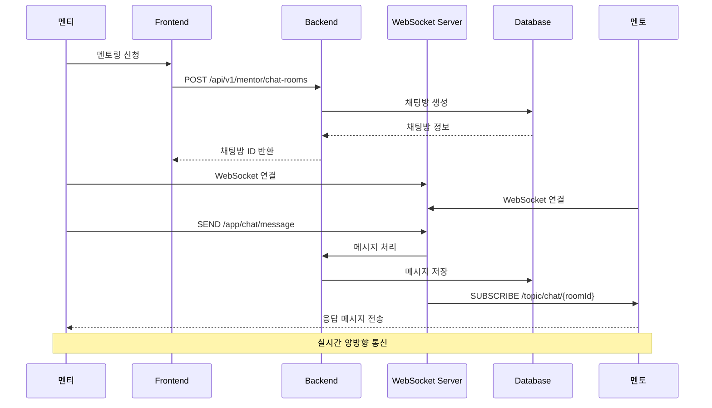
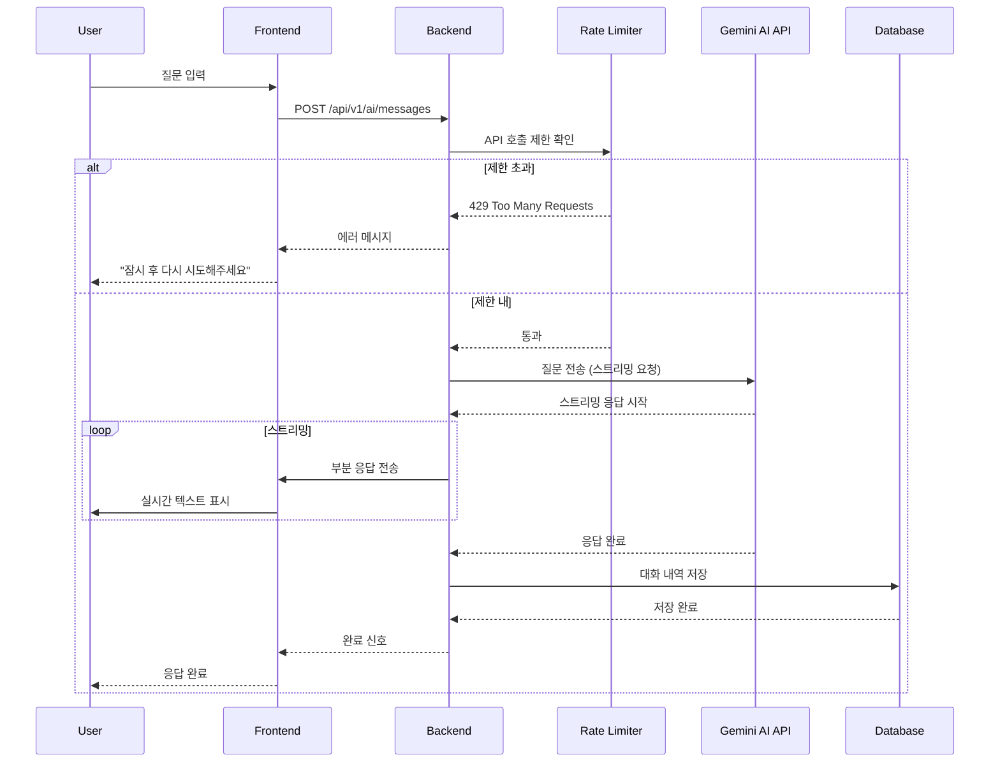
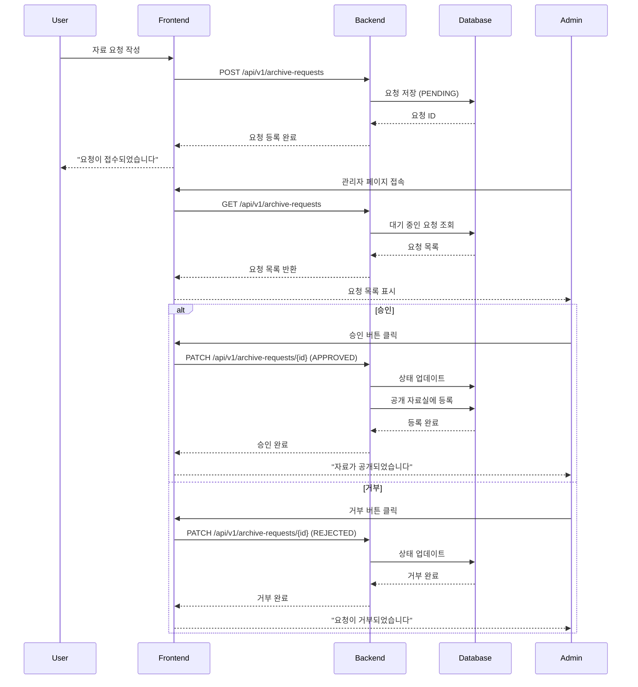

# 🎓 디딤돌 - 디지털 소외계층을 위한 교육 플랫폼


> 시니어와 디지털 초보자를 위한 **AI 기반 3D 맞춤형 교육 플랫폼** 백엔드 API 서버

**MOCI 3D**는 디지털 소외계층의 디지털 리터러시 향상을 목표로, **멘토-멘티 매칭**, **AI 챗봇 학습 지원**, **교육 자료 공유** 등을 제공하는 종합 교육 플랫폼입니다.

---

## 📋 목차

- [팀원 및 역할 분담](#-팀원-및-역할-분담)
- [주요 기능](#-주요-기능)
- [기술 스택](#-기술-스택)
- [시스템 아키텍처](#-시스템-아키텍처)
- [프로젝트 구조](#-프로젝트-구조)
- [ERD (Entity Relationship Diagram)](#-erd-entity-relationship-diagram)
- [시스템 플로우](#-시스템-플로우)
- [설치 및 실행](#-설치-및-실행)
- [API 문서](#-api-문서)
- [주요 기능 설명](#-주요-기능-설명)
- [보안 및 인증](#-보안-및-인증)
- [라이센스](#-라이센스)

---

## 👥 팀원 및 역할 분담

<table>
  <tr>
    <th>프로필</th>
    <th>이름</th>
    <th>역할</th>
    <th>GitHub</th>
    <th>담당 기능</th>
  </tr>
  <tr>
    <td></td>
    <td><strong>순태열</strong></td>
    <td>Product Owner</td>
    <td><a href="https://github.com/SoonTaeYouL">@SoonTaeYouL</a></td>
    <td>📁 <strong>파일 업로드 & WebRTC</strong><br/>- AWS S3 파일 업로드<br/>- WebRTC 화상 통화<br/>- P2P 시그널링 서버</td>
  </tr>
  <tr>
    <td></td>
    <td><strong>박영진</strong></td>
    <td>Backend Lead</td>
    <td><a href="https://github.com/MadeByPark">@MadeByPark</a></td>
    <td>🔐 <strong>인증/인가 시스템</strong><br/>- JWT 기반 로그인/로그아웃<br/>- 소셜 로그인 (카카오/구글/네이버)<br/>- 자동 토큰 갱신<br/>- 사용자 정보 관리</td>
  </tr>
  <tr>
    <td></td>
    <td><strong>김성철</strong></td>
    <td>AI & DevOps Engineer</td>
    <td><a href="https://github.com/SeongChoel">@SeongChoel</a></td>
    <td>🤖 <strong>AI 챗봇 & 인프라</strong><br/>- AI 질문/답변 처리<br/>- 스트리밍 응답 구현<br/>- AWS EC2/RDS 배포<br/>- CI/CD 파이프라인 구축</td>
  </tr>
  <tr>
    <td></td>
    <td><strong>박태규</strong></td>
    <td>Backend & DevOps Engineer</td>
    <td><a href="https://github.com/NewplayerKOR">@NewplayerKOR</a></td>
    <td>📚 <strong>교육 자료실 & 인프라</strong><br/>- 공개 자료실 CRUD<br/>- 자료 요청 승인 시스템<br/>- 인프라 관리 및 모니터링</td>
  </tr>
  <tr>
    <td></td>
    <td><strong>정주신</strong></td>
    <td>Real-time Communication Engineer</td>
    <td><a href="https://github.com/ehrl1225">@ehrl1225</a></td>
    <td>💬 <strong>실시간 채팅 시스템</strong><br/>- WebSocket 실시간 채팅<br/>- 멘토-멘티 매칭<br/>- 채팅 히스토리 관리</td>
  </tr>
</table>

---

## ✨ 주요 기능

### 📁 **파일 업로드 & WebRTC** (순태열)
- **AWS S3 연동**: 클라우드 기반 파일 저장
- **파일 메타데이터 관리**: 파일명, URL, 크기 등 관리
- **다중 파일 업로드**: 여러 파일 동시 업로드 지원
- **실시간 화상 멘토링**: 화면 공유 및 음성/영상 통화
- **P2P 연결**: WebRTC 기반 저지연 통신

### 🔐 **인증/인가 시스템** (박영진)
- **일반 로그인**: 전화번호 기반 JWT 인증
- **소셜 로그인**: 카카오, 구글, 네이버 OAuth2 연동
- **자동 토큰 갱신**: Refresh Token을 활용한 무중단 인증
- **역할 기반 접근 제어**: USER, MENTOR, ADMIN 권한 관리
- **디지털 레벨 시스템**: 사용자의 디지털 리터러시 수준 측정 (0~5단계)

### 🤖 **AI 챗봇 학습 지원** (김성철)
- **AI 기반 Q&A**: 디지털 관련 질문에 AI가 답변 제공
- **스트리밍 응답**: 실시간 스트리밍 방식의 자연스러운 대화
- **Rate Limiting**: Bucket4j를 활용한 API 호출 제한
- **대화 저장**: 사용자별 AI 채팅 기록 관리

### 📚 **교육 자료실** (박태규)
- **공개 자료실**: 교육 자료 업로드 및 공유
- **자료 요청 시스템**: 사용자 요청 → 관리자 승인 → 자료실 등록 프로세스
- **카테고리 분류**: 주제별 자료 분류 및 검색
- **승인 관리**: 관리자의 자료 요청 승인/거부

### 💬 **멘토-멘티 채팅** (정주신)
- **1:1 실시간 채팅**: WebSocket(STOMP) 기반 멘토링
- **채팅방 관리**: 멘토-멘티 매칭 및 히스토리 관리
- **알림 기능**: 새 메시지 실시간 알림

---

## 🛠 기술 스택

### **Backend Framework**
- **Spring Boot 3.5.5** (Java 21)
- **Spring Security** - 인증/인가
- **Spring Data JPA** - ORM 및 데이터 접근
- **QueryDSL** - 타입 안전 쿼리 작성

### **Database**
- **MySQL 8.0** (운영)
- **H2 Database** (개발/테스트)

### **Authentication & Security**
- **JWT (JSON Web Token)** - Stateless 인증
- **OAuth 2.0** - 소셜 로그인 (Kakao, Google, Naver)
- **BCrypt** - 비밀번호 암호화

### **Real-time Communication**
- **WebSocket + STOMP** - 채팅 메시징
- **WebRTC** - P2P 화상 통화
- **Spring WebFlux** - 비동기 HTTP 클라이언트 (AI API)

### **Cloud & Storage**
- **AWS S3** - 파일 저장소
- **AWS EC2** - 서버 호스팅
- **AWS RDS** - 데이터베이스

### **API & Documentation**
- **SpringDoc (Swagger)** - API 문서 자동 생성
- **RESTful API** - 표준 HTTP 메서드

### **DevOps**
- **Gradle** - 빌드 도구
- **GitHub Actions** - CI/CD

### **Libraries & Tools**
- **Lombok** - 보일러플레이트 코드 제거
- **Bucket4j** - Rate Limiting
- **KOMORAN** - 한국어 형태소 분석

---

## 🏗 시스템 아키텍처

```
┌─────────────────┐
│   Frontend      │
│  (Next.js 14)   │
└────────┬────────┘
         │ HTTP/WebSocket
         │
┌────────▼───────────────────────────────────────┐
│           Load Balancer (nginx)                │
└────────┬───────────────────────────────────────┘
         │
┌────────▼────────┐
│  Spring Boot    │ ◄──────► ┌──────────────┐
│   Application   │          │  AWS S3      │
│                 │          │ File Storage │
│  - REST API     │          └──────────────┘
│  - WebSocket    │
│  - Security     │
└────────┬────────┘
         │
    ┌────┼────┐
    │    │    │
┌───▼──┐ │ ┌──▼──────┐
│ MySQL│ │ │ AI API  │
│  RDS │ │ │(Gemini) │
└──────┘ │ └─────────┘
         │
    ┌────▼──────┐
    │  Redis    │
    │ (예정)    │
    └───────────┘
```

---

## 📁 프로젝트 구조

```
src/main/java/com/moci_3d_backend/
│
├── domain/                          # 도메인 계층 (비즈니스 로직)
│   │
│   ├── user/                        # 👤 사용자 관리 (박영진 - Backend Lead)
│   │   ├── controller/              # - 회원가입, 로그인, 내 정보 조회
│   │   ├── service/                 # - 비밀번호 변경, 이메일 수정
│   │   ├── repository/              # - 디지털 레벨 설정, 회원 탈퇴
│   │   ├── dto/                     
│   │   └── entity/User.java         
│   │
│   ├── chat/                        
│   │   ├── mentor/                  # 💬 멘토링 채팅 (정주신 - Real-time Engineer)
│   │   │   ├── mentorChatRoom/      # - 멘토-멘티 1:1 채팅방
│   │   │   └── mentorChatMessage/   # - WebSocket 실시간 메시징
│   │   │                            # - 채팅 히스토리 관리
│   │   └── ai/                      # 🤖 AI 챗봇 (김성철 - AI Engineer)
│   │       ├── aiChatRoom/          # - AI 채팅방 생성/조회
│   │       └── aiChatMessage/       # - AI 질문/답변 처리
│   │                                # - 스트리밍 응답
│   │
│   ├── archive/                     # 📚 교육 자료실 (박태규 - Backend Engineer)
│   │   ├── public_archive/          # - 공개 자료실 (CRUD)
│   │   └── archive_request/         # - 자료 요청 및 승인 시스템
│   │                                # - 관리자 승인/거부 기능
│   │
│   ├── fileUpload/                  # 📁 파일 업로드 (순태열 - PO)
│   │   ├── controller/              # - AWS S3 연동
│   │   ├── service/                 # - 파일 메타데이터 관리
│   │   └── entity/                  # - 다중 파일 업로드
│   │
│   └── webRTC/                      # 🎥 화상 통화 (순태열 - PO)
│       ├── controller/              # - WebRTC 시그널링
│       └── dto/                     # - P2P 연결 관리
│
├── global/                          # 전역 설정 및 공통 기능
│   ├── security/                    # 🔒 보안 설정 (박영진 - Backend Lead)
│   │   ├── SecurityConfig.java      # - Spring Security 설정
│   │   ├── CustomOAuth2UserService.java         # - OAuth2 소셜 로그인
│   │   ├── CustomOAuth2LoginSuccessHandler.java # - 로그인 성공 처리
│   │   ├── CustomAuthenticationFilter.java      # - JWT 인증 필터
│   │   └── SecurityUser.java        # - 인증된 사용자 정보
│   │
│   ├── webSocket/                   # 💬 WebSocket 설정 (정주신 - Real-time Engineer)
│   │   └── WebSocketConfig.java     # - STOMP 설정
│   │
│   ├── config/                      # 각종 설정
│   ├── exception/                   # 예외 처리
│   ├── util/                        # 유틸리티
│   └── initData/                    # 초기 데이터
│
└── external/                        # 외부 API 연동
    └── ai/                          # 🤖 AI 서비스 연동 (김성철 - AI Engineer)
        └── GeminiService.java       # - Gemini API 호출
```

---

## 📊 ERD (Entity Relationship Diagram)

### **데이터베이스 스키마**



---

## 🔄 시스템 플로우

### **전체 시스템 플로우 (Overall System Flow)**

사용자가 시스템을 이용하는 전체 여정을 나타낸 플로우차트입니다.



---

### **1. 인증 플로우 (Authentication Flow)**



### **2. 멘토링 채팅 플로우 (Mentoring Chat Flow)**



### **3. AI 챗봇 플로우 (AI Chatbot Flow)**



### **4. 자료 요청 및 승인 플로우 (Archive Request Flow)**



---

## 🚀 설치 및 실행

### **1. 사전 요구사항**
- **Java 21** 이상
- **MySQL 8.0** (또는 H2 Database)
- **Gradle 8.x**
- **AWS 계정** (S3 사용 시)

### **2. 데이터베이스 설정**

#### MySQL 사용 (권장):
```bash
# MySQL 실행
docker run -d \
  --name moci-mysql \
  -e MYSQL_ROOT_PASSWORD=root \
  -e MYSQL_DATABASE=moci_db \
  -p 3306:3306 \
  mysql:8.0
```

#### H2 Database 사용 (개발용):
```yaml
# application-dev.yml에 이미 설정되어 있음
spring:
  datasource:
    url: jdbc:h2:./db_dev
```

### **3. 환경변수 설정**

프로젝트 루트의 `.env.example` 파일을 복사하여 `.env` 파일을 생성하고 실제 값을 입력하세요:

```bash
# .env.example을 복사하여 .env 파일 생성
cp .env.example .env
```

**`.env.example` 파일 내용:**

```properties
# ========================================
# MOCI-3D Backend 환경변수 설정 파일
# ========================================
# 이 파일을 복사해서 .env 파일로 만들고 실제 값을 입력
# EC2 배포 시 Terraform output에서 값을 가져와서 설정
# 로컬 개발 시 dev 프로필 사용 (H2 DB)

# ========================================
# Spring Profile
# ========================================
SPRING_PROFILES_ACTIVE=YOUR_SPRING_PROFILE

# ========================================
# Database (RDS MySQL) - Terraform으로 생성 후 값 입력
# ========================================
DB_HOST=YOUR_DB_HOST
DB_PORT=YOUR_DB_PORT
DB_NAME=YOUR_DB_NAME
DB_USERNAME=YOUR_DB_USERNAME
DB_PASSWORD=YOUR_DB_PASSWORD

# ========================================
# JPA Settings
# ========================================
JPA_DDL_AUTO=YOUR_JPA_DDL_AUTO

# ========================================
# AWS S3 - Terraform으로 생성 후 값 입력
# ========================================
S3_BUCKET_NAME=YOUR_S3_BUCKET_NAME
AWS_ACCESS_KEY_ID=YOUR_AWS_ACCESS_KEY_ID
AWS_SECRET_ACCESS_KEY=YOUR_AWS_SECRET_ACCESS_KEY
AWS_REGION=YOUR_AWS_REGION
FILE_STORAGE_TYPE=YOUR_FILE_STORAGE_TYPE

# ========================================
# JWT
# ========================================
JWT_SECRET_KEY=YOUR_JWT_SECRET_KEY

# ========================================
# OAuth2
# ========================================
SPRING__SECURITY__OAUTH2__CLIENT__REGISTRATION__KAKAO__CLIENT_ID=YOUR_KAKAO_CLIENT_ID
SPRING__SECURITY__OAUTH2__CLIENT__REGISTRATION__NAVER__CLIENT_ID=YOUR_NAVER_CLIENT_ID
SPRING__SECURITY__OAUTH2__CLIENT__REGISTRATION__NAVER__CLIENT_SECRET=YOUR_NAVER_CLIENT_SECRET
SPRING__SECURITY__OAUTH2__CLIENT__REGISTRATION__GOOGLE__CLIENT_ID=YOUR_GOOGLE_CLIENT_ID
SPRING__SECURITY__OAUTH2__CLIENT__REGISTRATION__GOOGLE__CLIENT_SECRET=YOUR_GOOGLE_CLIENT_SECRET

# ========================================
# Gemini API
# ========================================
GEMINI_API_KEY=YOUR_GEMINI_API_KEY
GEMINI_API_URL=YOUR_GEMINI_API_URL

# ========================================
# Domain & CORS
# ========================================
COOKIE_DOMAIN=YOUR_COOKIE_DOMAIN
FRONT_URL=YOUR_FRONT_URL
BACK_URL=YOUR_BACK_URL
```

> **⚠️ 보안 주의사항**
> - `.env` 파일은 절대 Git에 커밋하지 마세요!
> - `.gitignore`에 `.env`가 포함되어 있는지 확인하세요.
> - 운영 환경에서는 환경변수를 EC2 서버에 직접 설정하세요.
> - Terraform을 사용하여 인프라를 배포한 경우, `terraform output`에서 RDS 엔드포인트와 S3 버킷명을 확인할 수 있습니다.

### **4. 애플리케이션 실행**

```bash
# 1. 프로젝트 클론
git clone https://github.com/your-repo/moci-3d-backend.git
cd moci-3d-backend

# 2. 빌드
./gradlew clean build

# 3. 실행 (개발 모드)
./gradlew bootRun --args='--spring.profiles.active=dev'

# 또는 JAR 파일 실행
java -jar build/libs/MOCI_3D_BACKEND-0.0.1-SNAPSHOT.jar --spring.profiles.active=dev
```

### **5. 접속 확인**

#### **운영 환경 (배포)**
- **웹 애플리케이션**: https://www.mydidimdol.com
- **API 서버**: https://api.mydidimdol.com
- **Swagger UI**: https://api.mydidimdol.com/swagger-ui/index.html

#### **개발 환경 (로컬)**
- **API 서버**: http://localhost:8080
- **Swagger UI**: http://localhost:8080/swagger-ui.html
- **H2 Console**: http://localhost:8080/h2-console

---

## 📖 API 문서

### **Swagger UI**

**운영 환경:**
```
https://api.mydidimdol.com/swagger-ui/index.html
```

**개발 환경:**
```
http://localhost:8080/swagger-ui.html
```

### **주요 API 엔드포인트**

#### 📁 파일 업로드 & 🎥 WebRTC (순태열)
```
# 파일 업로드
POST   /api/v1/file/upload           # 파일 업로드 (S3)
GET    /api/v1/file/{id}             # 파일 정보 조회
DELETE /api/v1/file/{id}             # 파일 삭제

# WebRTC
POST   /api/v1/webrtc/offer          # Offer 전송
POST   /api/v1/webrtc/answer         # Answer 전송
POST   /api/v1/webrtc/ice-candidate  # ICE Candidate 교환
```

#### 🔐 인증/사용자 (박영진)
```
POST   /api/v1/auth/register        # 회원가입
POST   /api/v1/auth/login            # 로그인
DELETE /api/v1/auth/logout           # 로그아웃
GET    /oauth2/authorization/{provider}  # 소셜 로그인 (kakao, google, naver)

GET    /api/v1/users/me              # 내 정보 조회
PATCH  /api/v1/users/digital-level   # 디지털 레벨 설정
PATCH  /api/v1/users/email           # 이메일 수정
PATCH  /api/v1/users/password        # 비밀번호 변경
DELETE /api/v1/users/me              # 회원 탈퇴
```

#### 🤖 AI 챗봇 (김성철)
```
POST   /api/v1/ai/chat-rooms         # AI 채팅방 생성
GET    /api/v1/ai/chat-rooms         # AI 채팅방 목록
POST   /api/v1/ai/messages           # AI에게 질문
GET    /api/v1/ai/messages/stream    # 스트리밍 응답
```

#### 📚 교육 자료실 (박태규)
```
# 공개 자료실
GET    /api/v1/archives              # 자료 목록 조회
GET    /api/v1/archives/{id}         # 자료 상세 조회
POST   /api/v1/archives              # 자료 등록 (ADMIN)
PUT    /api/v1/archives/{id}         # 자료 수정 (ADMIN)
DELETE /api/v1/archives/{id}         # 자료 삭제 (ADMIN)

# 자료 요청
POST   /api/v1/archive-requests      # 자료 요청 등록
GET    /api/v1/archive-requests      # 요청 목록 조회
GET    /api/v1/archive-requests/{requestId} # 요청 상세 조회
PUT    /api/v1/archive-requests/{requestId} # 자료 요청 수정
DELETE //api/v1/archive-requests/{requestId} # 자료 요청 삭제
PATCH  /api/v1/archive-requests/{id} # 승인/거부 (ADMIN)
```

#### 💬 멘토링 채팅 (정주신)
```
POST   /api/v1/mentor/chat-rooms     # 채팅방 생성
GET    /api/v1/mentor/chat-rooms     # 내 채팅방 목록
GET    /api/v1/mentor/chat-rooms/{id} # 채팅방 상세

WebSocket: /ws-stomp                 # 실시간 메시지 전송
  SEND: /app/chat/message            # 메시지 전송
  SUBSCRIBE: /topic/chat/{roomId}    # 메시지 수신
```

---

## 🔍 주요 기능 설명

### 📁 1. 파일 업로드 & WebRTC (순태열)

#### **AWS S3 통합**
```java
파일 업로드 → S3 저장 → URL 반환 → DB에 메타데이터 저장
```

#### **지원 기능**
- 다중 파일 업로드
- 파일 타입 검증
- 파일 크기 제한
- 안전한 파일명 생성

#### **WebRTC P2P 연결**
```
Peer A ←─ Signaling Server ─→ Peer B
   │                              │
   └──────── WebRTC P2P ─────────┘
```

#### **화상 통화 기능**
- 화면 공유
- 음성/영상 통화
- 저지연 통신

---

### 🔐 2. 인증/인가 시스템 (박영진)

#### **JWT 기반 인증**
```
로그인 → Access Token (20분) + Refresh Token (7일) 발급
       → 쿠키에 저장 (HttpOnly, Secure)
       → 20분 후 자동 갱신 (Refresh Token 사용)
       → 7일 후 재로그인 필요
```

#### **소셜 로그인 지원**
- OAuth2 기반 소셜 로그인 연동
- 지원 플랫폼: **카카오**, **구글**, **네이버**

#### **디지털 레벨 시스템**
- 회원가입 후 설문조사를 통해 디지털 리터러시 수준 측정
- 레벨 0~5: 초보자 → 전문가
- 레벨에 따른 맞춤형 콘텐츠 제공 (예정)

---

### 🤖 3. AI 챗봇 (김성철)

#### **Gemini AI 연동**
```java
사용자 질문 → Gemini API 호출 → 스트리밍 응답 → 클라이언트에 전달
```

#### **Rate Limiting**
- Bucket4j를 활용한 API 호출 제한
- 사용자당 분당 10회 제한
- 남용 방지

---

### 📚 4. 교육 자료실 (박태규)

#### **자료 요청 프로세스**
```
사용자 요청 → 관리자 검토 → 승인/거부
              ↓
         자료실에 등록 (승인 시)
```

#### **카테고리 분류**
- 카카오톡
- 시외버스
- 쿠팡
- 배달의 민족
- KTX
- 유튜브

---

### 💬 5. 멘토링 채팅 시스템 (정주신)

#### **WebSocket 실시간 통신**
```
STOMP 프로토콜 사용
  ├─ /app/chat/message      → 메시지 전송
  ├─ /topic/chat/{roomId}   → 메시지 수신
  └─ JWT 인증 필수
```

#### **채팅방 관리**
- 멘토-멘티 1:1 매칭
- 채팅 히스토리 저장
- 읽음/안읽음 상태 관리

---

## 🔒 보안 및 인증

### **보안 기능**
- ✅ JWT 기반 Stateless 인증
- ✅ BCrypt 비밀번호 암호화
- ✅ HttpOnly, Secure 쿠키
- ✅ CORS 정책 적용
- ✅ OAuth2 소셜 로그인
- ✅ 자동 토큰 갱신
- ✅ 비밀번호 변경 시 현재 비밀번호 확인

### **권한 계층**
```
ADMIN > MENTOR > USER

ADMIN:  모든 권한
MENTOR: USER 권한 + 멘토링 제공
USER:   기본 권한
```

---

## 🎨 개발 환경별 설정

### **개발 환경 (dev)**
```yaml
spring.profiles.active: dev
- H2 인메모리 DB
- 개발용 초기 데이터 자동 생성
- 상세 로그 출력
- CORS: localhost:3000 허용 (로컬 개발용)
```

### **운영 환경 (prod)**
```yaml
spring.profiles.active: prod
- MySQL RDS
- AWS S3 연동
- 보안 강화 (HTTPS 필수)
- CORS: www.mydidimdol.com 허용
- 도메인: api.mydidimdol.com
```

---

## 📊 성능 최적화

- **QueryDSL**: 타입 안전 쿼리 및 복잡한 조회 최적화
- **N+1 문제 해결**: Fetch Join 활용
- **Rate Limiting**: API 호출 제한으로 서버 보호
- **비동기 처리**: WebFlux를 활용한 AI API 호출

---

## 🧪 테스트

```bash
# 전체 테스트 실행
./gradlew test

# 특정 테스트 실행
./gradlew test --tests AuthControllerTest

# 테스트 커버리지 리포트
./gradlew jacocoTestReport
```


## 📞 문의

프로젝트 관련 문의는 이슈를 등록해주세요.

- **웹 서비스**: https://www.mydidimdol.com
- **API 문서**: https://api.mydidimdol.com/swagger-ui/index.html
- **GitHub Repository**: [프로젝트 저장소 링크]

---

## 🙏 감사의 글

이 프로젝트는 **디지털 소외계층의 디지털 리터러시 향상**을 목표로 개발되었습니다.  
모든 팀원들의 노력과 헌신에 감사드립니다.

---


**© 2025 MOCI 3D Team. All rights reserved.**
